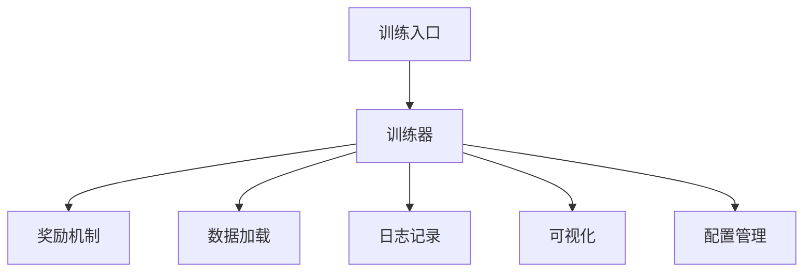
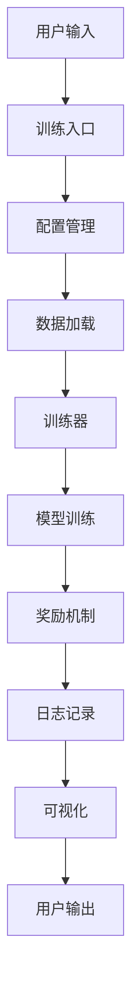

# SBS System

SBS System 是一个用于训练和评估基于 LLaVA 模型的深度学习框架，支持多种训练模式，包括自监督学习、强化学习和主动学习。该系统旨在通过高效的训练和回测机制，帮助用户优化交易策略。

## 架构图


## 各部分实现

### 1. 数据加载
- 使用 `torch.utils.data.DataLoader` 加载数据，支持多线程数据加载以提高效率。
- 数据集包括标记和未标记的数据，支持主动学习和自监督学习。

### 2. 模型训练
- 使用 `SBSTrainer` 类实现模型的训练逻辑。
- 支持多卡训练，通过 `torch.nn.DataParallel` 实现。
- 使用混合精度训练（`torch.cuda.amp`）以提高训练速度和减少显存占用。

### 3. 强化学习
- 实现强化学习逻辑，通过奖励机制优化模型决策。
- 使用 `RewardMechanism` 类计算奖励并更新模型。

### 4. 回测与可视化
- 实现回测功能，评估模型在历史数据上的表现。
- 使用 `matplotlib` 可视化回测结果，生成图表以便分析。

### 5. 日志记录
- 使用 Python 的 `logging` 模块记录训练过程中的重要信息和损失值。

## 安装和使用

### 依赖项
确保安装以下依赖项：
```bash
pip install -r requirements.txt
```

### 运行项目
使用以下命令启动训练：
```bash
python src/sbs_train.py --config <config_file> --mode <training_mode>
``` 

## 贡献指南

欢迎贡献代码！请遵循以下步骤：
1. Fork 本项目。
2. 创建您的特性分支 (`git checkout -b feature/YourFeature`)。
3. 提交您的更改 (`git commit -m 'Add some feature'`)。
4. 推送到分支 (`git push origin feature/YourFeature`)。
5. 创建一个新的 Pull Request.

## 项目简介

SBS System 是一个用于训练和评估自监督学习、强化学习和主动学习模型的框架。该项目提供了统一的训练入口，支持多种训练模式，并集成了奖励机制、数据加载、模型评估等功能。通过使用该系统，用户可以方便地进行模型训练、调试和评估。

### 背景信息

随着机器学习和深度学习的快速发展，越来越多的应用场景需要高效的模型训练和评估工具。SBS System 旨在提供一个灵活且易于使用的框架，以支持多种学习模式，帮助研究人员和开发者更好地实现他们的目标。

## 特性

- **多种训练模式**：支持标准训练、自监督学习、强化学习和主动学习。
- **奖励机制**：动态计算和调整奖励值，以适应不同的市场条件和交易表现。
- **数据加载**：高效的数据加载功能，支持多线程处理。
- **可视化**：提供训练过程中的可视化功能，帮助用户理解模型性能。
- **日志记录**：详细记录训练过程中的重要信息，便于调试和分析。

## 目录结构

```
app/: 应用程序主要代码
config/: 配置文件
data/: 数据文件
logs/: 日志文件
models/: 模型相关代码
prompts/: 提示词模板
scripts/: 工具脚本
src/: 源代码
tests/: 测试代码
docs/: 文档
```

## 组件功能

### 1. 训练入口 (`src/sbs_train.py`)
- **功能**：提供统一的训练入口，支持多种训练模式（标准、自监督、强化学习、主动学习）。
- **命令行参数解析**：解析用户输入的命令行参数，设置训练环境和随机种子。
- **配置文件加载**：加载配置文件并根据命令行参数覆盖配置，确保灵活性。
- **训练器创建**：根据配置创建训练器实例，并调用训练方法开始训练。

### 2. 训练器 (`src/self_supervised/trainer/sbs_trainer.py`)
- **功能**：统一的 SBS 序列模型训练器，支持多种训练模式。
- **模型初始化**：根据配置初始化模型、优化器、奖励计算器、交易跟踪器、评估器和数据加载器。
- **训练和验证**：提供训练、验证和保存模型检查点的功能，确保模型性能的持续监控。
- **早停机制**：支持早停机制，根据验证集性能自动停止训练，避免过拟合。
- **动态学习率调整**：根据训练进度动态调整学习率，提高训练效率。
- **日志记录**：记录训练过程中的重要信息和调试信息，便于后续分析。

### 3. 奖励机制 (`src/self_supervised/utils/reward_calculator.py`)
- **功能**：计算模型的奖励值，支持多种奖励计算方法。
- **奖励计算方法**：根据预测结果和真实标签计算准确度奖励、序列奖励和市场条件调整奖励。
- **动态调整**：提供动态调整奖励参数的功能，以适应不同的市场条件和交易表现。
- **历史记录**：记录交易历史和奖励计算的详细信息，便于后续分析。

### 4. 数据加载 (`src/self_supervised/utils/data_loader.py`)
- **功能**：提供数据加载功能，支持标准训练、自监督训练和主动学习的数据加载。
- **多线程处理**：处理数据批次，支持多线程处理，提高数据加载效率。
- **数据预处理**：根据需求对数据进行预处理，确保数据质量。

### 5. 配置管理 (`src/self_supervised/utils/config_manager.py`)
- **功能**：加载和保存配置文件，支持 YAML 格式。
- **配置读取**：提供配置的读取和写入功能，确保灵活性和可维护性。
- **错误处理**：处理配置文件加载中的错误，确保系统稳定性。

### 6. 日志记录 (`src/self_supervised/utils/logger.py`)
- **功能**：设置日志记录器，支持不同的日志级别。
- **信息记录**：记录训练过程中的重要信息和调试信息，便于后续分析。
- **日志格式**：自定义日志格式，确保信息清晰易读。

### 7. 可视化 (`src/self_supervised/visualization/visualization.py`)
- **功能**：提供可视化功能，绘制训练损失曲线和验证 F1 分数曲线。
- **数据展示**：通过图表展示训练过程中的关键指标，帮助用户理解模型性能。
- **图表定制**：支持图表的定制，满足不同用户的需求。

## 安装指南

### 系统要求
- 操作系统：Linux、macOS 或 Windows
- Python 版本：3.6 及以上
- 硬件要求：支持 CUDA 的 GPU（可选）

### 安装步骤
1. **克隆或下载项目**：
   ```bash
   git clone https://github.com/yourusername/sbs_system.git
   cd sbs_system
   ```
2. **安装依赖项**：
   ```bash
   pip install -r requirements.txt
   ```
3. **配置环境变量**（如有必要）：
   根据项目需求设置相应的环境变量。

## 使用说明

### 基本用法
使用以下命令启动训练：
```bash
python src/sbs_train.py --config <配置文件路径> --mode <训练模式> --output_dir <输出目录>
```

### 示例代码
以下是一个基本的使用示例：
```python
# 示例代码
import os
from src.self_supervised.trainer.sbs_trainer import SBSTrainer

config = {'optimizer': {'type': 'adam', 'learning_rate': 0.001}, 'epochs': 10, 'log_dir': 'logs'}
trainer = SBSTrainer(config=config, mode='standard')
trainer.train()
```

### 命令行参数
- `--config`: 配置文件路径，包含训练参数和模型配置。
- `--mode`: 训练模式，可选值为 `standard`, `self_supervised`, `rl`, `active_learning`。
- `--output_dir`: 输出目录，用于保存训练结果和日志。

## 配置

### 配置文件
配置文件应为 YAML 格式，示例如下：
```yaml
optimizer:
  type: adam
  learning_rate: 0.001
  weight_decay: 0.0001
epochs: 100
batch_size: 32
log_dir: logs
train_data_path: data/train.csv
val_data_path: data/val.csv
```

### 环境变量
列出需要设置的环境变量及其说明（如有必要）。

## 贡献指南

### 贡献流程
欢迎任何形式的贡献！请提交问题、建议或拉取请求。
- **提交问题**：在 GitHub 上提交问题，描述您遇到的任何问题。
- **提交拉取请求**：在您的分支上进行更改并提交拉取请求。

### 代码风格指南
遵循 PEP 8 规范，确保代码可读性。

### 开发环境设置
提供开发环境的设置说明。

## 测试

### 测试说明
项目中包含了测试用例，使用 `pytest` 进行测试：
```bash
pytest src/tests/
```

### 测试覆盖率工具
使用 `pytest-cov` 进行测试覆盖率分析：
```bash
pytest --cov=src
```

## 文档和示例

### 详细文档

确保每个模块和功能都有详细的文档说明，便于后续的维护和扩展。以下是系统的整体流程和逻辑：

### 1. 数据处理与图片生成
- **数据来源**：系统从原始CSV文件中读取数据，处理后生成相应的K线图。
- **生成过程**：使用Matplotlib等库生成图表，并将生成的图片保存到指定的输出路径。

### 2. 模型训练
- **训练阶段**：生成的图片将用于模型的训练，包括自监督学习、强化学习和主动学习等多个环节。
- **奖励机制**：模型在执行交易时会根据市场表现和预设的奖励机制计算奖励，成功的交易会获得正奖励，而失败的交易则会受到惩罚。
- **动态调整**：根据计算得到的奖励，模型会调整其策略，以提高未来的决策质量。

### 3. 回测与评估
- **回测函数**：在训练完成后，系统会进行回测，评估模型的表现并生成报告。
- **性能指标**：计算回测结果的性能指标，为后续生成报告提供数据支持。

### 4. 报告生成
- **报告内容**：使用 `ReportGenerator` 类生成训练和评估报告，报告中包含训练过程中的关键指标、模型配置、训练历史等信息。
- **保存报告**：生成的报告将保存到指定路径，便于后续查看和分析。

### 5. 监控与调整
- **实时监控**：在训练过程中，实时监控模型的表现，并根据实时反馈调整训练策略。
- **可视化工具**：使用可视化工具（如TensorBoard）监控训练过程中的关键指标，帮助快速识别问题。

### 示例代码
以下是一个基本的使用示例：
```python
# 示例代码
import os
from src.self_supervised.trainer.sbs_trainer import SBSTrainer

config = {'optimizer': {'type': 'adam', 'learning_rate': 0.001}, 'epochs': 10, 'log_dir': 'logs'}
trainer = SBSTrainer(config=config, mode='standard')
trainer.train()
```

### 监控和可视化
在训练过程中，您可以使用 TensorBoard 监控训练过程中的指标。确保在训练时记录必要的指标，以便在 TensorBoard 中查看。

## 常见问题解答（FAQ）

### 常见问题
- **如何设置训练参数？**
  您可以通过配置文件设置训练参数，具体请参考配置部分。
- **如何处理训练中的错误？**
  请查看日志文件，了解错误的详细信息，并根据提示进行调试。

## 许可证

本项目遵循 MIT 许可证。有关详细信息，请参阅 LICENSE 文件。

## 项目结构图

以下是项目的结构图，展示了各个组件之间的关系：



## 树状图

以下是项目的树状图，展示了文件和目录的层次结构：

```
SBS System
├── app
├── config
├── data
├── logs
├── models
├── prompts
├── scripts
├── src
│   ├── self_supervised
│   │   ├── trainer
│   │   ├── utils
│   │   └── visualization
│   └── tests
└── docs
```

## 架构图

以下是项目的架构图，展示了系统的整体结构和数据流：



该架构图展示了用户如何通过训练入口输入参数，配置管理如何加载配置，数据加载如何准备数据，训练器如何进行模型训练，以及奖励机制如何计算奖励，最终通过日志记录和可视化反馈给用户。

## 训练流程

在模型生成输出并保存为JSON文件后，系统会进入训练阶段。这一阶段通常包括自监督学习、强化学习和主动学习等多个环节。

### 1. 奖励机制的应用
- **奖励计算**：模型在执行交易时会根据市场表现和预设的奖励机制计算奖励。例如，成功的交易会获得正奖励，而失败的交易则会受到惩罚。
- **更新模型**：根据计算得到的奖励，模型会调整其策略，以提高未来的决策质量。这通常通过反向传播和优化算法（如PPO）来实现。

### 2. 多种机制的结合
除了奖励机制，模型训练还会结合其他机制，例如：
- **经验回放**：在强化学习中，模型会存储过去的经验（状态、动作、奖励等），并在后续训练中随机抽取这些经验进行学习，以提高样本效率。
- **主动学习**：在主动学习阶段，模型会选择不确定性较高的样本进行人工标注，以提高模型的学习效率和准确性。
- **自监督学习**：在自监督学习阶段，模型会利用未标注的数据进行预训练，以提取特征和模式。

### 3. 训练过程的监控和调整
在整个训练过程中，系统会监控模型的表现，并根据评估结果调整训练策略。例如：
- **调整学习率**：如果模型的表现不佳，可能会降低学习率以稳定训练过程。
- **策略调整**：根据回测结果和市场反馈，模型的策略可能会进行动态调整，以适应市场变化。