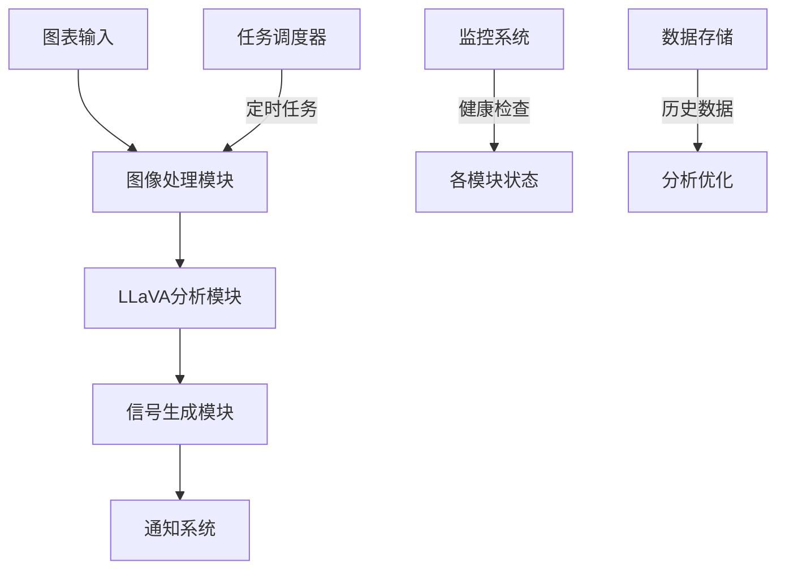

# SBS系统架构

本文档描述SBS交易分析系统的架构设计和主要模块。

## 系统架构图

## 核心模块

### 1. 图像处理模块
- 职责：负责图表预处理和质量控制
- 组件：
  - 图像预处理器
  - 质量控制器
  - 特征提取器
- 技术：OpenCV, PIL

### 2. LLaVA分析模块
- 职责：核心AI分析引擎
- 组件：
  - LLaVA视觉语言模型
  - 提示词生成器
  - 上下文管理器
- 技术：LLaVA, VLLM

### 3. 信号生成模块
- 职责：交易信号生成和过滤
- 组件：
  - 信号提取器
  - 信号过滤器
  - 信号验证器
- 技术：自定义规则引擎

### 4. 通知系统
- 职责：多渠道信息分发
- 组件：
  - 消息格式化器
  - 消息分发器
  - 消息接收确认
- 技术：Discord, Webhook

### 5. 任务调度模块
- 职责：定时任务管理
- 组件：
  - 计划任务管理器
  - 执行监控器
- 技术：APScheduler

### 6. 监控系统
- 职责：性能和健康监控
- 组件：
  - 健康检查器
  - 性能监控器
  - 告警管理器
- 技术：Prometheus, Grafana

### 7. 数据存储
- 职责：历史数据管理和分析
- 组件：
  - 数据存储管理器
  - 查询接口
  - 数据分析工具
- 技术：SQLite, Pandas

## 数据流

1. 外部图表通过API或定时任务输入到系统
2. 图像处理模块预处理图表
3. LLaVA分析模块分析处理后的图表
4. 信号生成模块从分析结果中提取交易信号
5. 通知系统将信号发送到配置的目标渠道

## 技术栈

- 后端：Python
- 模型：LLaVA-v1.6-7b
- 图像处理：OpenCV, PIL
- 数据存储：SQLite
- 任务调度：APScheduler
- 监控：Prometheus, Grafana
- 通知：Discord, Webhook 